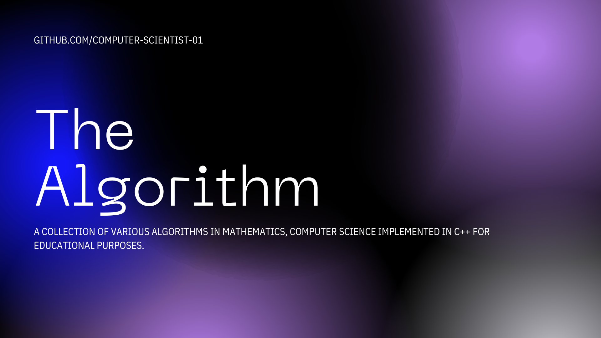

<h1>
The Algorithms</h1>

A collection of various algorithms in mathematics, computer science implemented in C++ for educational purposes.

  

The [The Algorithms](https://github.com/NovaVerseOrg/FluxNet) is not ready for a `0.1` release yet; it is still a work in progress.

## Contents

- [Mathematics](#mathematics)
- [Team](#team)

     

# Mathematics
| Difficulty | Filename | Brief Description                                                      |
| ---------- | -------- | ---------------------------------------------------------------------- |
| **Easy**   | area.cpp | Computes area of basic shapes (circle, triangle, etc.) using formulas. |

# Team

* **[Suraj Yadav](https://github.com/Computer-Scientist-01)**: founder of [NovaVerseOrg](https://github.com/NovaVerseOrg)